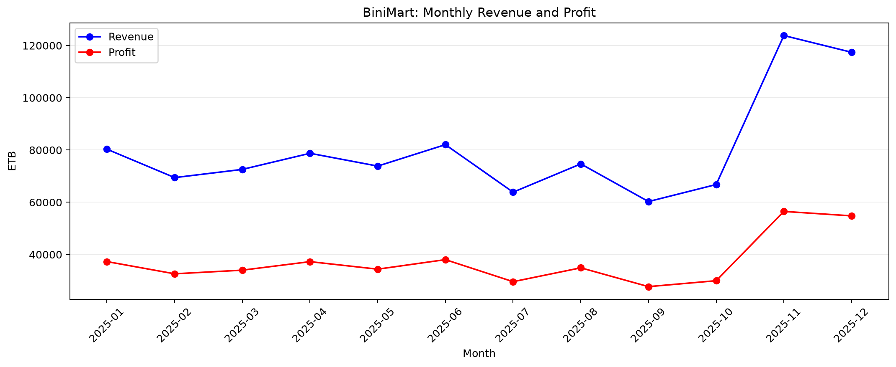
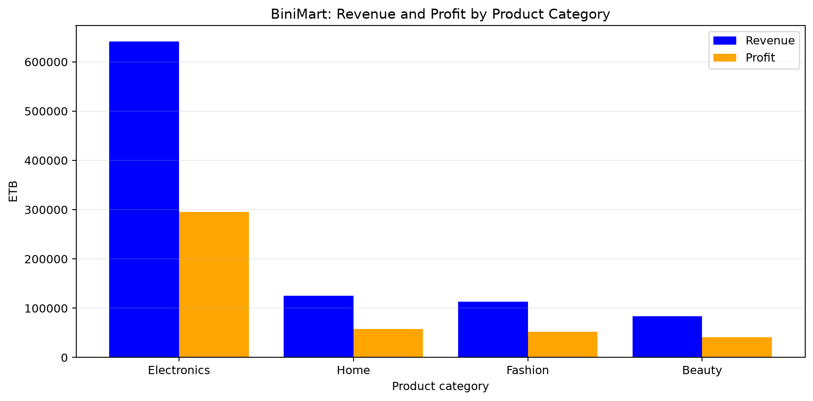
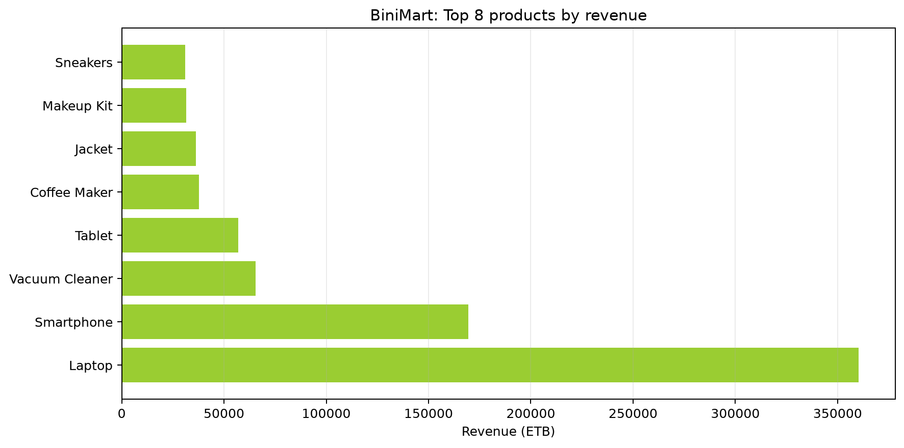
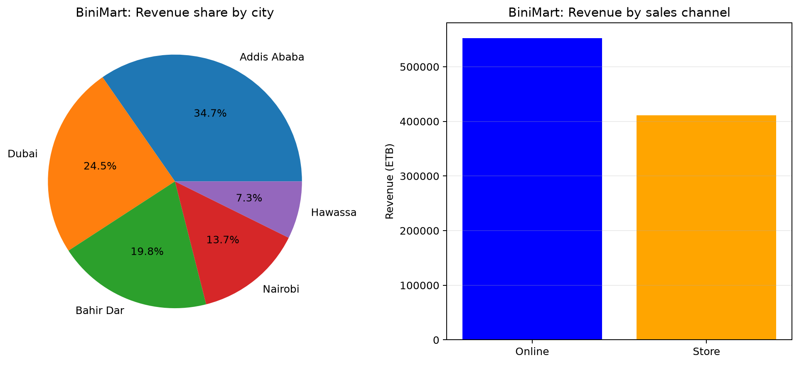

# 📊 BiniMart: Retail Sales Data Analysis & Insights


## 📌 Executive Summary
This project is an end-to-end data analysis pipeline designed to extract actionable business intelligence from retail transaction data. Using a programmatically generated 2025 sales dataset for a fictional retailer, BiniMart, this project analyzes over a year of transactions to identify revenue drivers, seasonal trends, and product performance.

**Goal:** To demonstrate proficiency in data manipulation, exploratory data analysis (EDA), and business-oriented data visualization to drive strategic decision-making.

---

## 🛠️ Technology Stack
* **Language:** Python
* **Data Manipulation:** Pandas, NumPy
* **Data Visualization:** Matplotlib
* **Reporting:** Markdown (Automated Report Generation)

---

## 📈 Key Business Insights & Visualizations

The Python script automatically processes the raw transaction data and generates the following insights, saving the output visualizations to the `results/` directory.

### 1. Revenue & Profit Trajectory
*Identifying seasonal peaks and overall financial health.*
> **Business Value:** Tracking revenue alongside profit margins highlights seasonal volatility. Identifying the drivers behind late-year spikes (e.g., Q4 holiday sales) is critical for future inventory planning and cash flow management.


### 2. Category Performance Analysis
*Evaluating which business units drive the most value.*
> **Business Value:** While Electronics is the dominant revenue driver, analyzing the profit margins across other categories like Fashion and Beauty warrants further pricing strategy reviews to optimize overall profitability.


### 3. Top Performing Products
*Isolating the Top 8 SKUs responsible for the highest sales volume.*
> **Business Value:** High-ticket items like Laptops and Smartphones dominate gross revenue. Marketing efforts and supply chain logistics should prioritize these items to ensure they never face stockouts.


### 4. Regional & Channel Breakdown
*Understanding customer demographics and purchasing behavior.*
> **Business Value:** Comparing physical retail vs. online channels across different cities helps optimize targeted marketing spend and informs future expansion strategies. 


---

## 🗂️ Data Architecture

The pipeline synthesizes a transaction-level dataset (`results/fictional_store_sales.csv`) with the following schema:

| Feature | Data Type | Description |
| :--- | :--- | :--- |
| `date` | `datetime` | Timestamp of the transaction |
| `city` | `string` | Retail location / Customer geography |
| `channel` | `string` | Point of sale (Online vs. Retail) |
| `category` | `string` | Broad product classification |
| `product` | `string` | Specific SKU/Item |
| `quantity` | `int` | Volume of items purchased |
| `unit_price`| `float` | Base price per item (ETB) |
| `revenue` | `float` | Gross revenue generated |
| `profit` | `float` | Net margin (Revenue - Cost of Goods Sold) |

---

## ⚙️ Reproducing the Analysis

To run this data pipeline locally and generate the reports and charts:

1. **Clone the repository and navigate to the project directory.**
2. **Install dependencies:**
   ```bash
   pip install pandas matplotlib numpy pathlib
3. **Execute the pipeline:**
    ```bash
    python app.py

